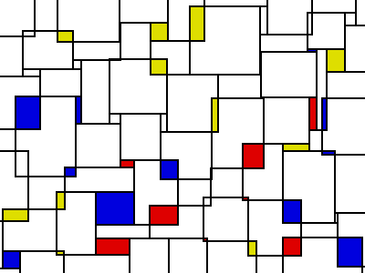

# mondrian
Mimic Mondrian paintings via Truchet tiling of the screen (cf [approach](http://www.algorithmic-worlds.net/blog/blog.php?Post=20110201)). 
Uses Pygame.

Future work:
- instead of filling with solid color, fill with a smaller Mondrian pattern.
- [tile-piling](http://www.algorithmic-worlds.net/blog/blog.php?Post=20110201)
- Mandelbrot Fractals of Mondrian?
- Mandalas?
